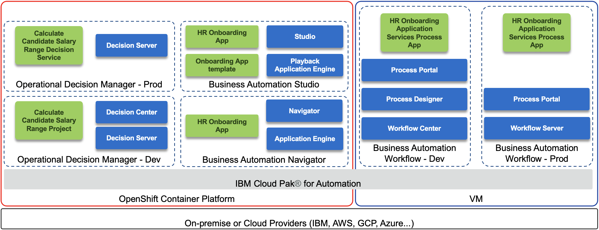

# Quickly create new automation solutions with low-code applications

Existing HR applications are not easily modified and often require the IT team to work with the vendor and make code changes.  There are often higher priority development projects that deliver customer value than HR.  The result: adhoc spreadsheets, emails and local file shares and a disorganized process inhibits the flow of applicants and HR teams are frustrated with slow results.  It's time for an easy to use low-code build environment where HR can create dynamic applications that connect to existing systems and deliver value quickly.

Are you ready to build low-code business applications?

---------

## HR Onboarding Application
**an IBM Cloud Pak for Business Automation entry point**

***

**Entry Point:** Quickly create new automation solutions with low-code applications

**Use Case Overview:** Existing HR applications are not easily modified and often require the IT team to work with the vendor and make code changes.  There are often higher priority development projects that deliver customer value than HR.  The result: adhoc spreadsheets, emails and local file shares and a disorganized process inhibits the flow of applicants and HR teams are frustrated with slow results.  It's time for an easy to use low-code build environment where HR can create dynamic applications that connect to existing systems and deliver value quickly.

**Trial Details:** If you have a Digital Business Automation on Cloud trial, your environment is predeployed, continue to the Guided Tour section within the [HR onboarding application use case](https://ibm-cloud-architecture.github.io/refarch-dba/use-cases/hr-onboard-app/).  Don't have a trial yet? <a href="https://www.ibm.com/account/reg/us-en/signup?formid=urx-45706" target="_blank">Sign up</a> to get started.

**Technical Details:** To deploy HR Onboarding App on your own environment and learn more about the technical architecture, read on!

### Architecture Diagram

The following diagram illustrates the products involved and the solution components:

 

### Environment

We assume the following products are installed, up and running:

* IBM Cloud Pak® for Automation version 20.0.3
    * Business Automation Workflow (BAW) on VMs (may work on OpenShift, has not been tested)
    * Operational Decision Manager (ODM) on OpenShift
    * Business Automation Studio and Application Engine (and/or Playback Engine)
    * Business Automation Navigator

### Deploy the artifacts

1. Determine your credentials
    1. For BAW, use your own credentials to login to Workflow Center and Process Portal
    1. For ODM, create a service credential/account or use your own basic auth credentials to login to Rule Execution Server console
    1. For Studio and Navigator, use your own credentials to login
1. Deploy ODM artifacts
    1. Login to Decision Center Business console
    1. On Library, click the import icon
    1. Choose and upload Calculate Candidate Salary Range [main] YYYY.MM.DD_XX.zip
    1. Open the main branch, click Deployments and deploy to your Rule Execution Server (adjust the server within the deployment configuration as required)
1. Deploy BAW artifacts
    1. Login to Workflow Center and navigate to Process Apps
    1. Import HR_Onboarding_Application_Services - YYYY.MM.DD_XX.twx
    1. Open the HR Onboarding Application Services process app and navigate to Process App Settings -> Servers
    1. Edit the settings for hostname, port, authentication and so forth for your ODM server
    1. Go back to Workflow Center and create a new snapshot of the process application
    1. Install the new snapshot to your Workflow Server unless you wish to run directly on Workflow Center's playback server
1. Deploy the latest Studio templates for your version
    1. Go to https://github.com/icp4a/ibm-app-designer-samples
    1. Set the branch to your platform version
    1. Download all templates from `App Templates` folder (at least Onboarding)
    1. Import them into your Studio Applications -> Templates environment

## Contributors
  * Lead content developer [Jeff Goodhue](https://www.linkedin.com/in/jeffreygoodhue/)
